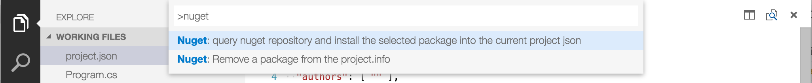

# Nuget4Code 

This is a simple extension to add and remove nuget packages to your project.json.

Feature:
- Query and add a package from official nuget.org repository
- Remove a referenced package
- Upgrade to latest

Current limitation:
- the repository is hard-coded to nuget.org.
- It only support one project.json. If you have multiple, it will check if the active document is a project.json and use that one if required.
- it only installs the latest version.
- it doesn't take care of the dependencies

Example :
